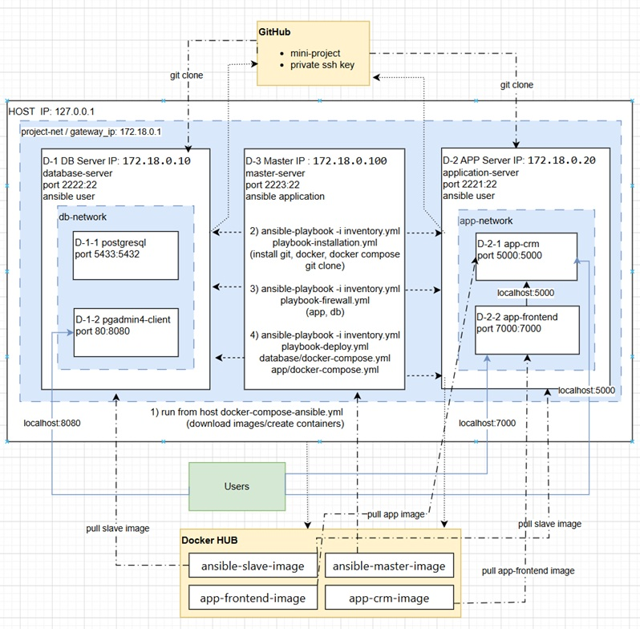

# mini-project



### Part 1

## Created a Private Repository with README file - mini-project
```
git clone https://github.com/evgeny-kor-m/mini-project.git
git branch worker
git checkout worker
git branch
```
Connects Docker running in console to Windows Credential Manager.
```
nano ~/.docker/config.json -> {   "auths": {}  } 
```

Created Makefile
```
make clean - remove all (images, containers, volumes, net)
make prerequisite - create net, volume
```

## Create ssh_key folder and generate key
```
mkdir ~/.ssh_key
mkdir -p ~/.ssh_key/etc/ssh
ssh-keygen -A -f ~/.ssh_key
ssh-keygen -t rsa -b 4096 -f ~/.ssh_key/id_rsa -N ""
mv ~/.ssh_key/id_rsa.pub ~/.ssh_key/authorized_keys
ssh-keygen -t ed25519 -C "ansible-deploy" -f ~/.ssh_key/github_deploy_key -N ""
mv ~/.ssh_key/github_deploy_key ~/.ssh_key/id_ed25519
cat github_deploy_key.pub            ### Repository → Settings → Deploy keys → Add deploy key
touch ~/.ssh_key/master_known_hosts
ssh-keyscan -t rsa github.com > ~/.ssh_key/slave_known_hosts
sudo chown -R appuser:appuser ~/.ssh_key
chmod 700 ~/.ssh_key
chmod 644 ~/.ssh_key/*.pub ~/.ssh_key/slave_known_hosts ~/.ssh_key/master_known_hosts
chmod 600 ~/.ssh_key/etc/ssh/ssh_host_rsa_key
chmod 600 ~/.ssh_key/etc/ssh/ssh_host_ed25519_key
chmod 600 ~/.ssh_key/*
```

## Created Dockerfile – Ansible Master , ENTRYPOINT change permitions for keys
```
docker build -t ansible-master-image -f ansible-master/Dockerfile .
docker run -d --name ansible-master-01 \
    --network project-net -p 2222:22 \
    -v ~/.ssh_key/master_known_hosts:/home/ansible/.ssh/known_hosts \
    -v ~/.ssh_key/id_rsa:/home/ansible/.ssh/id_rsa \
    ansible-master-image
```

## Created Dockerfile – Ansible Slave  , ENTRYPOINT change permitions for keys
```
docker build -t ansible-slave-image -f ansible-slave/Dockerfile .
docker run -d --name ansible-slave-01 \
    --network project-net -p 2221:22 \
    -v ~/.ssh_key/authorized_keys:/home/ansible/.ssh/authorized_keys \
    -v ~/.ssh_key/slave_known_hosts:/home/ansible/.ssh/known_hosts \
    -v ~/.ssh_key/id_ed25519:/home/ansible/.ssh/id_ed25519 \    
     ansible-slave-image
```
## Check access from master to slave
```
docker exec -it ansible-master-01 su - ansible
ssh-keyscan -t rsa ansible-slave-01 >> /home/ansible/.ssh/known_hosts
ansible -i /app/ansible/inventory.yml slaves -m ping
ssh -i /home/ansible/.ssh/id_rsa ansible@ansible-slave-01
```
## Created Docker Compose – Ansible
```
docker compose -f ./ansible/docker-compose.yml --env-file .env  up -d
docker compose -f ./ansible/docker-compose.yml --env-file .env  build
make start-ansible - create images and up containers
make trust - Ssh-keyscan for slaves
```
## Push both images to DockerHub as Public repositories
```
docker tag  ansible-slave-image  evgenykorchev/ansible-slave-image:v02
docker push evgenykorchev/ansible-slave-image:v02

docker tag ansible-master-image evgenykorchev/ansible-master-image:v02
docker push evgenykorchev/ansible-master-image:v02
```

### Part 2
## Dockerfile – Application
Manuall run application:
```
python app/src/app_crm.py
docker rm -f app-crm && docker rmi -f app-crm-image
http://127.0.0.1:5000/healthcheck
```
## Docker Compose – Application
```
docker build -t app-frontend-image -f app/backend/Dockerfile .
docker compose --env-file .env -f ./app/docker-compose.yml up -d    --force-recreate

docker tag app-crm-image evgenykorchev/app-frontend-image:v02
docker push evgenykorchev/app-frontend-image:v02
docker tag app-crm-image evgenykorchev/app-crm-image:v02
docker push evgenykorchev/app-crm-image:v02
```
## Docker Compose – Database (PostgreSQL + pgAdmin)
For local testing
PostgreSQL  https://github.com/docker-library/docs/blob/master/postgres/README.md#environment-variables
```
docker pull postgres
docker pull dpage/pgadmin4
docker compose --env-file .env -f ./database/docker-compose.yml up -d  --force-recreate
docker exec -it postgresql psql -U postgres

docker rm -f postgresql && docker volume rm shared-volume

docker run --name postgresql -d -p 5433:5432  \
               --network=project-net \
               -e POSTGRES_PASSWORD=postgresdb \
               -v shared-volume:/var/lib/postgresql postgres

docker exec postgresql env | grep POSTGRES
-- openning access to postgres from all IP address (from HOST)
    docker exec postgresql cat /var/lib/postgresql/18/docker/pg_hba.conf  | tail -10
    docker exec postgresql bash -c "echo 'host all all 0.0.0.0/0 md5' >> /var/lib/postgresql/18/docker/pg_hba.conf"
    docker restart postgresql
```
pgAdmin - availible
http://localhost:8080
polzovatel@gmail.com/pass

## Common docker compose for Master, Database and Application server
Example of creation container with the required privileges
```
docker run -d --privileged --name database-server -v /var/lib/docker:/var/lib/docker ubuntu:latest
```
Run and check playbooks:
```
docker compose --env-file .env config ## check syntaxis
docker compose --env-file .env up -d   ## --force-recreate   ## --remove-orphans
ansible-playbook -i /app/ansible/inventory.yml /app/ansible/playbook-installation.yml --syntax-check
ansible-playbook -i /app/ansible/inventory.yml /app/ansible/playbook-deploy.yml --check
```
Connect to servers:
```
ssh -i /home/ansible/.ssh/id_rsa ansible@database-server
ssh -i /home/ansible/.ssh/id_rsa ansible@application-server

docker exec -it database-server su - ansible
docker exec -it application-server su - ansible
docker exec -it master-server su - ansible
```

Useble command for example:
```
ansible-playbook -i /app/ansible/inventory.yml /app/ansible/playbook-installation.yml --tags "clone_repo"
ansible -i /app/ansible/inventory.yml db_servers -m shell -a "cd /home/ansible/mini-project && docker compose --env-file .env -f database/docker-compose.yml down -v" -b
ansible -i /app/ansible/inventory.yml app_servers -m shell -a "cd /home/ansible/mini-project && docker compose --env-file .env -f app/docker-compose.yml down -v" -b
ansible -i /app/ansible/inventory.yml db_servers -m shell -a "docker logs postgresql | tail -20" -b
ansible -i /app/ansible/inventory.yml db_servers -m shell -a "docker exec postgresql psql -U postgres -d postgres -c '\\dt'" -b
```

## firewall
```
ansible-playbook -i /app/ansible/inventory.yml /app/ansible/playbook-firewall.yml --check
```
check status:
```
ansible -i /app/ansible/inventory.yml slaves  -m shell -a "ufw status numbered" -b
ansible -i /app/ansible/inventory.yml db_servers -m shell -a "ufw status numbered" -b
ansible -i /app/ansible/inventory.yml app_servers  -m shell -a "ufw status numbered" -b
```
TASK [Show firewall rules for verification]
```
ok: [master-node] => {
    "msg": [
        "Status: active",
        "",
        "     To                         Action      From",
        "     --                         ------      ----",
        "[ 1] 53                         ALLOW OUT   Anywhere                   (out) # Allow updates, Docker HUB access, and DNS resolution",
        "[ 2] 80                         ALLOW OUT   Anywhere                   (out) # Allow updates, Docker HUB access, and DNS resolution",
        "[ 3] 443                        ALLOW OUT   Anywhere                   (out) # Allow updates, Docker HUB access, and DNS resolution",
        "[ 4] 22/tcp                     ALLOW IN    172.18.0.1                 # SSH management from host only",
        "[ 5] 172.18.0.10 22/tcp         ALLOW OUT   Anywhere                   (out) # SSH to database-server",
        "[ 6] 172.18.0.20 22/tcp         ALLOW OUT   Anywhere                   (out) # SSH to application-server",
        "[ 7] 53 (v6)                    ALLOW OUT   Anywhere (v6)              (out) # Allow updates, Docker HUB access, and DNS resolution",
        "[ 8] 80 (v6)                    ALLOW OUT   Anywhere (v6)              (out) # Allow updates, Docker HUB access, and DNS resolution",
        "[ 9] 443 (v6)                   ALLOW OUT   Anywhere (v6)              (out) # Allow updates, Docker HUB access, and DNS resolution"
    ]
}
ok: [db-slave-node] => {
    "msg": [
        "Status: active",
        "",
        "     To                         Action      From",
        "     --                         ------      ----",
        "[ 1] 53                         ALLOW OUT   Anywhere                   (out) # Allow updates, Docker HUB access, and DNS resolution",
        "[ 2] 80                         ALLOW OUT   Anywhere                   (out) # Allow updates, Docker HUB access, and DNS resolution",
        "[ 3] 443                        ALLOW OUT   Anywhere                   (out) # Allow updates, Docker HUB access, and DNS resolution",
        "[ 4] 22/tcp                     ALLOW IN    172.18.0.100               # SSH from master-server only",
        "[ 5] 5432/tcp                   ALLOW IN    172.18.0.20                # From Application server only",
        "[ 6] 8080/tcp                   ALLOW IN    172.18.0.1                 # SSH from Host/Gateway only",
        "[ 7] 53 (v6)                    ALLOW OUT   Anywhere (v6)              (out) # Allow updates, Docker HUB access, and DNS resolution",
        "[ 8] 80 (v6)                    ALLOW OUT   Anywhere (v6)              (out) # Allow updates, Docker HUB access, and DNS resolution",
        "[ 9] 443 (v6)                   ALLOW OUT   Anywhere (v6)              (out) # Allow updates, Docker HUB access, and DNS resolution"
    ]
}
ok: [app-slave-node] => {
    "msg": [
        "Status: active",
        "",
        "     To                         Action      From",
        "     --                         ------      ----",
        "[ 1] 53                         ALLOW OUT   Anywhere                   (out) # Allow updates, Docker HUB access, and DNS resolution",
        "[ 2] 80                         ALLOW OUT   Anywhere                   (out) # Allow updates, Docker HUB access, and DNS resolution",
        "[ 3] 443                        ALLOW OUT   Anywhere                   (out) # Allow updates, Docker HUB access, and DNS resolution",
        "[ 4] 22/tcp                     ALLOW IN    172.18.0.100               # SSH from master-server only",
        "[ 5] 5000/tcp                   ALLOW IN    Anywhere                   # Flask API endpoint",
        "[ 6] 7000/tcp                   ALLOW IN    Anywhere                   # Frontend web interface",
        "[ 7] 172.18.0.10 5432/tcp       ALLOW OUT   Anywhere                   (out) # Connect to PostgreSQL on database-server",
        "[ 8] 53 (v6)                    ALLOW OUT   Anywhere (v6)              (out) # Allow updates, Docker HUB access, and DNS resolution",
        "[ 9] 80 (v6)                    ALLOW OUT   Anywhere (v6)              (out) # Allow updates, Docker HUB access, and DNS resolution",
        "[10] 443 (v6)                   ALLOW OUT   Anywhere (v6)              (out) # Allow updates, Docker HUB access, and DNS resolution",
        "[11] 5000/tcp (v6)              ALLOW IN    Anywhere (v6)              # Flask API endpoint",
        "[12] 7000/tcp (v6)              ALLOW IN    Anywhere (v6)              # Frontend web interface"
```